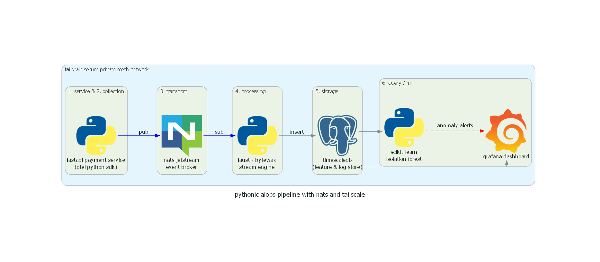

# submit.md

## 1. architecture diagram

***figure 1*: архитектурная диаграмма пайплайна наблюдаемости**

## 2. cost estimate breakdown

| tier | component | build (self-host) | buy (datadog) |
| :--- | :--- | :--- | :--- |
| small | storage | $30.22 | $5,250.00 |
| small | compute | $120.00 | $230.00 |
| small | network/addons | $45.00 | $800.00 |
| small | total | $195.22 | $6,280.00 |
| medium | storage | $302.21 | $52,500.00 |
| medium | compute | $650.00 | $2,300.00 |
| medium | network/addons | $250.00 | $7,500.00 |
| medium | total | $1,202.21 | $62,300.00 |
| large | storage | $3,022.08 | $525,000.00 |
| large | compute | $4,500.00 | $23,000.00 |
| large | network/addons | $1,800.00 | $72,000.00 |
| large | total | $9,322.08 | $620,000.00 |

## 3. adr decision summary
i decided to transition from a fully managed datadog saas observability model to a self-hosted, python-native aiops stack using opentelemetry, nats jetstream, bytewax, and timescaledb over a tailscale network. the primary driver was the massive cost disparity at the large scale tier ($620,000.00/month for datadog vs $9,322.08/month self-hosted). while building in-house introduces operational overhead, my direct familiarity and prior success building pipelines with flask and nats heavily mitigated the execution risk, making the 98.5% cost reduction a necessary and highly viable move.

## 4. reflection: series a startup (50 services)
if hired as a platform engineer for a startup that just raised a series a and runs roughly 50 microservices, my recommendation would be to strictly buy. 

at 50 services, the company is sitting right on the border between the small and medium cost tiers. while datadog would cost roughly $6k to $30k a month depending on data volume, the primary goal of a series a startup is feature velocity and finding strict product-market fit, not shaving infrastructure margins.

if i build a custom nats and timescaledb stack right now, i would have to spend 80% of my time patching databases, managing storage volumes, and fixing pipeline bugs instead of supporting the product developers. the monthly cost of datadog at this stage is significantly cheaper than hiring two additional platform engineers to maintain the self-hosted stack. i would recommend buying datadog to guarantee immediate, zero-maintenance visibility today, with a roadmap to revisit the build option once the company hits series c and the log volume costs begin to outpace engineering salaries.